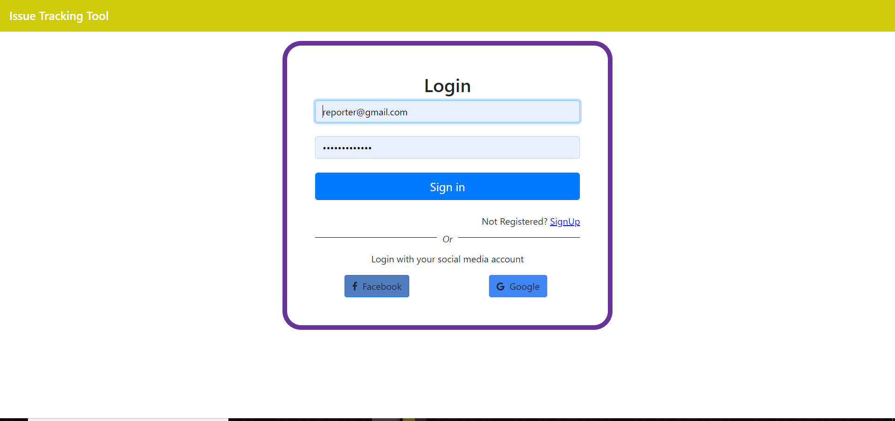
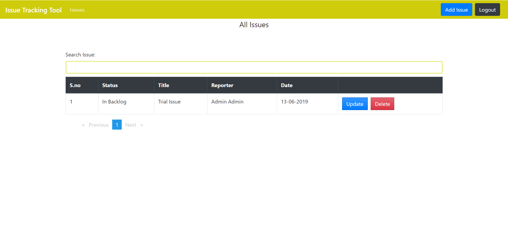
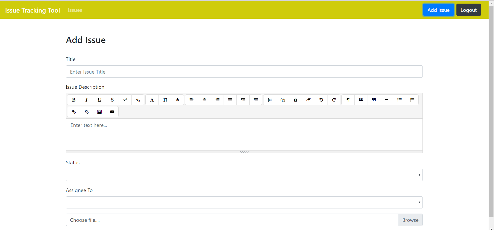
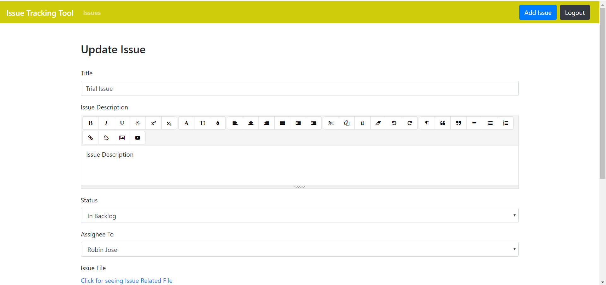

# IssueTrackingTool

This project was generated with [Angular CLI](https://github.com/angular/angular-cli) version 6.0.8.

##Screenshot

# UserManagement



# All Issues



# Add Issue



# Update Issue



## Getting Started

Install Angular CLI

```
npm install -g @angular/cli
```

## Prerequisites

1. [Node.js](https://nodejs.org/en/download/)
2. Angular CLI

## Installing 

1. Create Empty Folder

2. Inside the folder run command `git init`

3. Then  `git remote add origin https://github.com/anshul1394/Issue-Tracking-Tool-Angular6.git`

4. `git pull origin master`

5. `npm install`

6. Open project in editor of your choice and navigate to `src/app/config/socialLoginConfig.ts `

7. Enter your Google and Facebook Developer Client ID

8. run you project using `ng serve`

## Development server

Run `ng serve` for a dev server. Navigate to `http://localhost:4200/`. The app will automatically reload if you change any of the source files.

## Code scaffolding

Run `ng generate component component-name` to generate a new component. You can also use `ng generate directive|pipe|service|class|guard|interface|enum|module`.

## Build

Run `ng build` to build the project. The build artifacts will be stored in the `dist/` directory. Use the `--prod` flag for a production build.

## Running unit tests

Run `ng test` to execute the unit tests via [Karma](https://karma-runner.github.io).

## Running end-to-end tests

Run `ng e2e` to execute the end-to-end tests via [Protractor](http://www.protractortest.org/).

## Further help

To get more help on the Angular CLI use `ng help` or go check out the [Angular CLI README](https://github.com/angular/angular-cli/blob/master/README.md).

## Live Deployment 
```
[https://massacre.co.in/login](https://massacre.co.in/login)
```

## Authors

* **Anshul Malhotra**

## Acknowledgments

* [edwisor](https://edwisor.com/)
